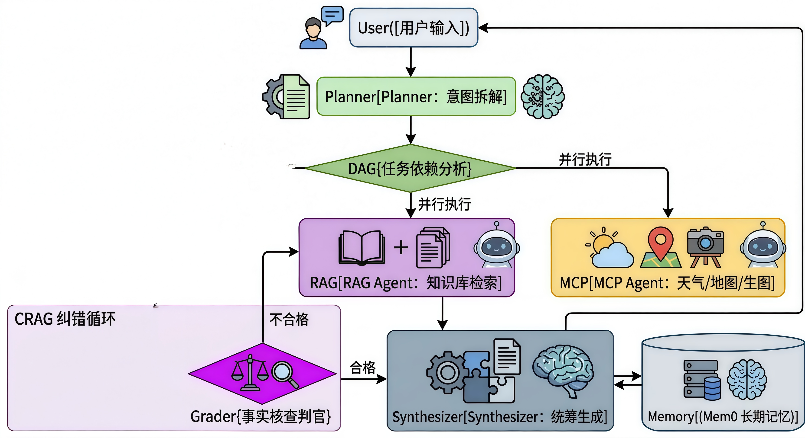
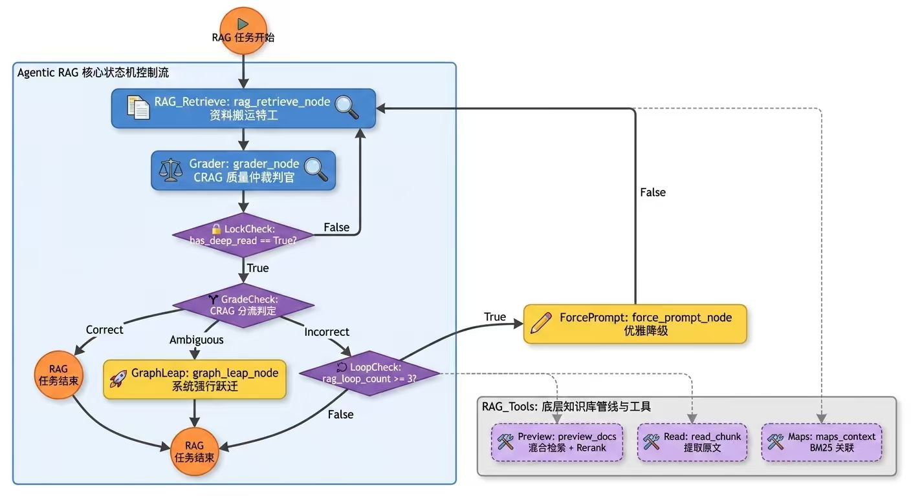

# 🍎 Shiliu-Agent (慧聚石榴)

> **基于 LLM-Compiler 架构的分层多智能体协同 RAG 框架 (Tiered Agentic RAG)**

[](https://www.python.org/)
[](LICENSE)
[](https://github.com/langchain-ai/langgraph)
[](https://github.com/mem0ai/mem0)

🌍 **Shiliu-Agent (慧聚石榴)** 是一个开源的、专为复杂场景设计的 **Agentic RAG** 编排框架。它打破了传统 RAG 的线性管道，引入了工业级的**全局规划（Planner）**、**依赖调度（DAG Fetcher）**与**自适应纠错（CRAG）**机制，旨在提供更精准、更具人格化的智能对话体验。

---


## ✨ 核心技术亮点

- **智能任务规划**: 基于 LLM-Compiler 架构，自动将复杂查询拆解为可并行执行的任务流
- **分层检索策略**: 采用"预览-精读-扩展"三段式检索，数据处理部分采取聚合成树，树成森林构成图形暗网的形式，有效控制 Token 消耗
- **多智能体协同**: 支持 RAG、MCP 等多种智能体并发执行
- **自适应纠错**: 内置 CRAG 机制，自动评估和纠正检索结果质量
- **持久化记忆**: 基于 Mem0 的用户长期画像与 Redis 的短期对话历史管理

---

## 🏗️ 系统架构


### 宏观架构




### 微观架构




---

## 🚀 快速开始

### 环境要求

- Python 3.10+
- 8GB+ 内存推荐

### 安装部署

1. **克隆项目**
```bash
git clone https://github.com/future-pang/Shiliu-Agent.git
cd Shiliu-Agent
```

2. **安装依赖**
```bash
pip install -r requirements.txt
```

3. **配置环境变量**
```bash
cp .env.example .env
# 编辑 .env 文件，填入您的 API Keys
```

4. **初始化知识库**
```bash
python main.py --mode ingest
```

5. **启动服务**
```bash
# 命令行交互
python main.py --mode chat
```

---

## 📖 使用示例

### 基础问答
```python
from server.agent.graph import create_graph

# 创建智能体图
app = create_graph()

# 执行查询
result = app.invoke({
    "messages": [{"role": "user", "content": "彝族火把节的历史起源是什么？"}]
})

print(result["messages"][-1]["content"])
```

### API 调用
```bash
curl -X POST "http://localhost:8000/chat" \
  -H "Content-Type: application/json" \
  -d '{"message": "介绍一下藏族的传统节日"}'
```

---

## 📁 项目结构

```
Shiliu-Agent/
├── configs/                    # 配置文件
├── server/
│   ├── agent/                 # 智能体编排
│   │   ├── nodes/             # 节点实现
│   │   └── utils/             # 工具函数
│   ├── knowledge_base/        # 知识库管理
│   └── tools/                 # 外部工具集成
├── storage/                   # 数据存储
├── data/                      # 原始数据
└── tests/                     # 测试用例
```

---

## 🔧 配置说明

### 模型配置
支持主流 LLM 提供商：
- OpenAI GPT-4/3.5
- Anthropic Claude
- 阿里云通义千问
- 字节跳动豆包

### 检索配置
- **向量模型**: 支持多种 Embedding 模型
- **重排模型**: BGE、ColBERT 等
- **向量数据库**: Chroma (默认)

详细配置请参考 `configs/settings.py` 文件。

---


## 🤝 贡献指南

欢迎提交 Issue 和 Pull Request！

1. Fork 本项目
2. 创建特性分支 (`git checkout -b feature/AmazingFeature`)
3. 提交更改 (`git commit -m 'Add some AmazingFeature'`)
4. 推送到分支 (`git push origin feature/AmazingFeature`)
5. 创建 Pull Request

---

## 📄 开源协议

本项目采用 MIT 协议开源。详见 [LICENSE](LICENSE) 文件。

---

## 🙏 致谢

感谢以下开源项目的支持：
- [LangGraph](https://github.com/langchain-ai/langgraph)
- [LlamaIndex](https://github.com/run-llama/llama_index)
- [Mem0](https://github.com/mem0ai/mem0)

---

**⭐ 如果这个项目对您有帮助，请给我们一个 Star！**

