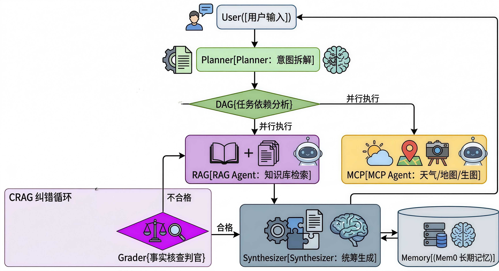
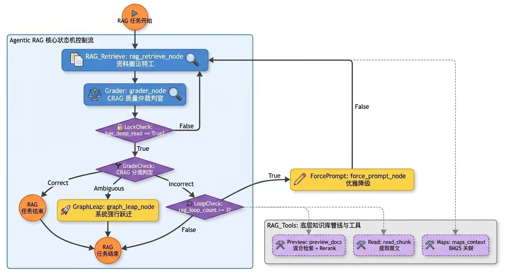

# 🍎 Shiliu-Agent

> **基于 LLM-Compiler 架构的分层多智能体协同 RAG 框架 (Tiered Agentic RAG)**

[](https://www.python.org/)
[](LICENSE)
[](https://github.com/langchain-ai/langgraph)
[](https://github.com/mem0ai/mem0)

🌍 **Shiliu-Agent** 是一个开源的、专为复杂场景设计的 **Agentic RAG** 编排框架。它打破了传统 RAG 的线性管道，引入了工业级的**全局规划（Planner）**、**依赖调度（DAG Fetcher）**与**自适应纠错（CRAG）**机制，并集成了独立的 **PDF 四层结构化解析管道** 与 **三层 RAG 自动化评测体系**，旨在提供更精准、更具可解释性的智能对话与深度知识问答体验。

---

## ✨ 核心技术亮点

- ⚡ **智能任务规划 (LLM-Compiler)**：自动将复杂的业务查询分解为 DAG 任务依赖网络，支持多路专家节点（RAG Agent, SQL Agent, MCP Agent）的并发与依赖流转调度。
- 🔍 **五策略自适应 Query 路由 (Query Router)**：内置智能意图分类器，根据问题复杂度自动分流至五大改写策略（Simple、Factual/HyDE、Multi-Angle、Complex/Decompose、Background/MacroContext），配合 **RRF (Reciprocal Rank Fusion)** 进行并发召回与去重融合。
- 🔄 **自适应纠错 (Corrective RAG)**：内置基于 LangGraph 的纠错内循环。Grader 节点对检索事实进行三档判定。针对 Ambiguous 缺失拼图，首创 **Graph Leap 机制** 直接从图谱中跃迁关联知识；针对多次重试未果，触发 Web Search 并优雅降级。
- 📄 **工业级 PDF 四层解析链路 (PDF RAG)**：完全独立于常规格式的专属 PDF 管道。实现：
  1. *解析层*：检测原生/扫描/图文混排类型，自适应调用 OCR (PaddleOCR) 及 Multimodal 视觉模型；
  2. *结构还原层*：推断层级关系并保留面包屑导航路径（第几章-第几节），过滤页眉脚，保留页码；
  3. *切片与索引*：语义边界分块，表格转 Markdown 并附加总结描述，生成独立的 ChromaDB 向量空间与 JSON 文档库；
  4. *智能工具链*：包装精准引用、表格提取、图表理解等 Tools，支持 Agent 进行细粒度精确精读。
- 📊 **三层 RAG 自动化评估框架 (RAG Eval)**：实现生产级数据驱动的评测系统：
  1. *检索质量*：评估召回率 (Context Recall) 与精确率 (Context Precision)；
  2. *生成质量*：评估回答忠实度 (Faithfulness) 与相关性 (Answer Relevancy)；
  3. *PDF 专项*：评测页码还原率、表格/图表提取偏差、OCR 漏字度。

---

## 🏗️ 系统架构

### 宏观架构



### 微观架构



---

## 📁 项目目录结构

```
Shiliu-Agent/
├── configs/                    # 系统与模型参数配置
├── server/
│   ├── agent/                 # 智能体编排与 LangGraph 工作流
│   │   ├── nodes/             # 图节点（RAG特工、Grader特工、图谱跃迁等）
│   │   └── graph.py           # LLM-Compiler 主图与 RAG 子图构建
│   ├── knowledge_base/        # 核心知识库检索与路由
│   │   ├── query_rewriter.py  # 5 种 Query 改写机制实现
│   │   ├── query_router.py    # 智能路由与 RRF 融合排序
│   │   └── handler.py         # 传统多格式知识库检索适配器
│   ├── pdf_rag/               # PDF 专属 RAG 四层处理链
│   │   ├── layer1_parser/     # PDF 检测、原生抽取、PaddleOCR 与视觉理解
│   │   ├── layer2_structure/  # 段落章节层级构建与元数据恢复
│   │   ├── layer3_chunking/   # 语义/表格/图表切片与孤立向量库索引
│   │   ├── layer4_tools/      # 供给 Agent 的 PDF 阅读器工具链
│   │   └── pipeline.py        # PDF 批量数据加工处理入口
│   └── tools/                 # 外部工具集成 (MCP、Web Search等)
├── tests/
│   └── rag_eval/              # 三层 RAG 自动化评估套件
│       ├── dataset/           # 评测样本黄金数据集
│       ├── metrics/           # 指标评估器（检索/生成/PDF专项指标）
│       ├── evaluator.py       # 评测协调引擎
│       └── run_eval.py        # 评测启动入口与自动诊断分析
```

---

## 🚀 快速开始

### 环境要求

- Python 3.10+
- 8GB+ 内存推荐
- 如需启用 OCR 请确保系统已安装 C++ 编译环境

### 安装部署

1. **克隆项目**
```bash
git clone https://github.com/liunor/Agentic-RAG****.git
cd Agentic-RAG
```

2. **安装依赖**
```bash
pip install -r requirements.txt
```

3. **配置环境变量**
```bash
cp .env.example .env
# 编辑 .env 文件，填入您的 LLM API Keys (及可选的 OCR、Web Search Keys)
```

4. **处理 PDF 专业数据（以构建 PDF RAG 专属索引）**
```bash
# 提取、解析并建库单份文件
python -m server.pdf_rag.pipeline --file path/to/document.pdf

# 或批量建库某一文件夹下的所有 PDF
python -m server.pdf_rag.pipeline --dir path/to/pdf_folder/
```

5. **运行 RAG 自动化评估**
```bash
# 启动 3 层评测对当前 RAG 检索生成及 PDF 模块进行跑分
python -m tests.rag_eval.run_eval
```

6. **启动智能问答对话**
```bash
# 命令行对话流交互
python main.py --mode chat
```

---

## 🔧 配置说明

详细配置请参考 `configs/settings.py` 与 `configs/model_config.yaml`。

### 核心模型矩阵
在模型配置文件中，支持细粒度指定不同节点所使用的专用 LLM：
- **RAG Agent (检索专员)**: `rag_llm`
- **Grader Agent (纠错判官)**: `grader_llm`
- **Planner (全局规划器)**: `planner_llm`
- **PDF Multimodal (多模态图表理解)**: `pdf_vision`

---

## 🤝 贡献指南

欢迎提交 Issue 和 Pull Request！

1. Fork 本项目
2. 创建特性分支 (`git checkout -b feature/AmazingFeature`)
3. 提交更改 (`git commit -m 'Add some AmazingFeature'`)
4. 推送到分支 (`git push origin feature/AmazingFeature`)
5. 创建 Pull Request

---

## 📄 开源协议

本项目采用 MIT 协议开源。详见 [LICENSE](LICENSE) 文件。

---

## 🙏 致谢

感谢以下开源项目的支持：
- [LangGraph](https://github.com/langchain-ai/langgraph)
- [PaddleOCR](https://github.com/PaddlePaddle/PaddleOCR)
- [ChromaDB](https://github.com/chroma-core/chroma)
- [LlamaIndex](https://github.com/run-llama/llama_index)
- [Mem0](https://github.com/mem0ai/mem0)

---

**⭐ 如果这个项目对您有帮助，请给我们一个 Star！**
